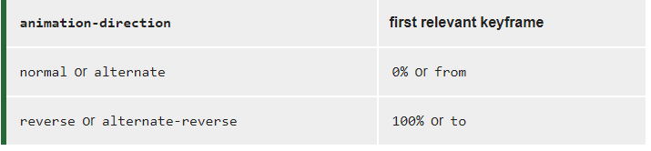

# CSS Animation（动画）

​		人类具有视觉暂留的特性，人的眼睛在看到一幅画或一个物体后，在0.34秒内不会消失。
​		动画原理：  通过把人物的表情、动作、变化等分解后画成许多动作瞬间的画幅，利用视觉暂留的原理，在一幅画还没有消失前，播放下一幅画。就会给人造成一种流畅的视觉变化效果。

[CSS](https://developer.mozilla.org/zh-CN/docs/Web/CSS) **animation** 属性是 [`animation-name`](https://developer.mozilla.org/zh-CN/docs/Web/CSS/animation-name)，[`animation-duration`](https://developer.mozilla.org/zh-CN/docs/Web/CSS/animation-duration), [`animation-timing-function`](https://developer.mozilla.org/zh-CN/docs/Web/CSS/animation-timing-function)，[`animation-delay`](https://developer.mozilla.org/zh-CN/docs/Web/CSS/animation-delay)，[`animation-iteration-count`](https://developer.mozilla.org/zh-CN/docs/Web/CSS/animation-iteration-count)，[`animation-direction`](https://developer.mozilla.org/zh-CN/docs/Web/CSS/animation-direction)，[`animation-fill-mode`](https://developer.mozilla.org/zh-CN/docs/Web/CSS/animation-fill-mode) 和 [`animation-play-state`](https://developer.mozilla.org/zh-CN/docs/Web/CSS/animation-play-state) 属性的一个简写属性形式。

css3动画:使元素从一种样式逐渐变化为另一种样式的效果  

animation属性是一个简写属性形式: （可以用来描述可动画的属性）
   可动画属性的列表：
          https://developer.mozilla.org/en-US/docs/Web/CSS/CSS_animated_properties   

简写属性的默认值：
       animation：
                 animation-name: none
                 animation-duration: 0s
                 animation-timing-function: ease
                 animation-delay: 0s
                 animation-iteration-count: 1
                 animation-direction: normal
                 animation-fill-mode: none
                 animation-play-state: running

​		在每个动画定义中，顺序很重要：可以被解析为 `time`的第一个值被分配给animation-duration, 第二个分配给 animation-delay。

```css
/* @keyframes duration | timing-function | delay |
   iteration-count | direction | fill-mode | play-state | name */
animation: 3s ease-in 1s 2 reverse both paused slidein;

/* @keyframes duration | timing-function | delay | name */
animation: 3s linear 1s slidein;

/* @keyframes duration | name */
animation: 3s slidein;

@keyframes slidein {
  from { transform: scaleX(0); }
  to   { transform: scaleX(1); }
}
```


## 关键帧（@keyframes）

语法：

 ```css
@keyframes animiationName{
    keyframes-selector{
        css-style;
    }
}
 ```

> animiationName:必写项，定义动画的名称
>  keyframes-selector：必写项，动画持续时间的百分比
>              from：0%
>              to：100%
>  css-style：css声明


## animation-name

```css
animation-name:slidein	
```

​		animation-name属性指定应用的一系列动画，每个名称代表一个由@keyframes定义的动画序列

值:

+ none：  特殊关键字，表示无关键帧。可以不改变其他标识符的顺序而使动画失效，或者使层叠的动画样式失效。
     

+ IDENT：标识动画的字符串，由大小写敏感的字母a-z、数字0-9、下划线(_)和/或横线(-)组成。第一个非横线字符必须是字母，数字不能在字母前面，不允许两个横线出现在开始位置。

## animation-duration

​		animation-duration属性指定一个动画周期的时长。默认值为0s，表示无动画。

值
    一个动画周期的时长，单位为秒(s)或者毫秒(ms)，无单位值无效。

> 注意：负值无效，浏览器会忽略该声明，但是一些早起的带前缀的声明会将负值当作0s
>
> **这是一个实验中的功能**
> 此功能某些浏览器尚在开发中，请参考[浏览器兼容性表格](https://developer.mozilla.org/zh-CN/docs/Web/CSS/animation-duration#browser_compatibility)以得到在不同浏览器中适合使用的前缀。由于该功能对应的标准文档可能被重新修订，所以在未来版本的浏览器中该功能的语法和行为可能随之改变。

## animation-timing-function

​		animation-timing-function属性定义CSS动画在每一动画周期中执行的节奏。 
​		对于关键帧动画来说，timing function作用于一个关键帧周期而非整个动画周期，即从关键帧开始，到关键帧结束。
​		定义于一个关键帧区块的缓动函数(animation timing function)应用到改关键帧；另外，若该关键帧没有定义缓动函数，则使用定义于整个动画的缓动函数。

动画的默认效果：由慢变快再变慢

+ linear:线性过渡，等同于贝塞尔曲线（0,0,1,1）
+ ease:平滑过渡，等同于贝塞尔曲线（0.25,0.1,0.25,1.0）
+ ease-in:由慢到快，等同于贝塞尔曲线（0.42,0,1,1）
+ ease-out:由快到慢，等同于贝塞尔曲线（0,0,0.58,1）
+ ease-in-out:由慢到快再到慢，等同于贝塞尔曲线（0.42,0,0.58,1）
+ cubic-bezier(1,1,2,3)

+ steps(n,[start|end]) 

  > 传入一到两个参数，第一个参数意思是把动画分成 n 等分，然后动画就会平均地运行。
  > 第二个参数 start 表示从动画的开头开始运行，相反，end 就表示从动画的结尾开始运行，
  > 默认值为 end。

## animation-delay

​		`animation-delay` [CSS](https://developer.mozilla.org/en-US/docs/Web/CSS)属性定义动画于何时开始，即从动画应用在元素上到动画开始的这段时间的长度。

​		`0s`是该属性的默认值，代表动画在应用到元素上后立即开始执行。否则，该属性的值代表动画样式应用到元素上后到开始执行前的时间长度；

​		定义一个负值会让动画立即开始。但是动画会从它的动画序列中某位置开始。例如，如果设定值为-1s，动画会从它的动画序列的第1秒位置处立即开始。

​		如果为动画延迟指定了一个负值，但起始值是隐藏的，则从动画应用于元素的那一刻起就获取起始值。

> **这是一个实验中的功能**
> 此功能某些浏览器尚在开发中，请参考[浏览器兼容性表格](https://developer.mozilla.org/zh-CN/docs/Web/CSS/animation-delay#browser_compatibility)以得到在不同浏览器中适合使用的前缀。由于该功能对应的标准文档可能被重新修订，所以在未来版本的浏览器中该功能的语法和行为可能随之改变。

## animation-iteration-count

```css
/* 值为关键字 */
animation-iteration-count: infinite;

/* 值为数字 */
animation-iteration-count: 3;
animation-iteration-count: 2.4;

/* 指定多个值 */
animation-iteration-count: 2, 0, infinite;
```

​		**`animation-iteration-count`** [CSS](https://developer.mozilla.org/en-US/CSS) 属性  定义动画在结束前运行的次数 可以是1次 无限循环.

​		如果指定了多个值，每次播放动画时，将使用列表中的下一个值，在使用最后一个值后循环回第一个值。

​		通常情况下，使用`animation`简写属性，来一次性设置所有动画属性会更方便。

值：

+ `infinite` 无限循环播放动画.
+  `number` 动画播放的次数；默认值为`1`。可以用小数定义循环，来播放动画周期的一部分：例如，`0.5` 将播放到动画周期的一半。不可为负值。

> **这是一个实验中的功能**
> 此功能某些浏览器尚在开发中，请参考[浏览器兼容性表格](https://developer.mozilla.org/zh-CN/docs/Web/CSS/animation-iteration-count#browser_compatibility)以得到在不同浏览器中适合使用的前缀。由于该功能对应的标准文档可能被重新修订，所以在未来版本的浏览器中该功能的语法和行为可能随之改变。

## animation-direction

```css
animation-direction: normal
animation-direction: reverse
animation-direction: alternate
animation-direction: alternate-reverse
animation-direction: normal, reverse
animation-direction: alternate, reverse, normal
```

​		`animation-direction` CSS 属性指示动画是否反向播放，它通常在简写属性[`animation`](https://developer.mozilla.org/zh-CN/docs/Web/CSS/animation)中设定。

值

+ normal : 每个循环内动画向前循环，换言之，每个动画循环结束，动画重置到起点重新开始，这是默认属性。

+ alternate 动画交替反向运行，反向运行时，动画按步后退，同时，带时间功能的函数也反向，比如，ease-in 在反向时成为ease-out。计数取决于开始时是奇数迭代还是偶数迭代

+ reverse 反向运行动画，每周期结束动画由尾到头运行。

+ alternate-reverse  反向交替， 反向开始交替

  > 动画第一次运行时是反向的，然后下一次是正向，后面依次循环。决定奇数次或偶数次的计数从1开始。

> **这是一个实验中的功能**
> 此功能某些浏览器尚在开发中，请参考[浏览器兼容性表格](https://developer.mozilla.org/zh-CN/docs/Web/CSS/animation-direction#browser_compatibility)以得到在不同浏览器中适合使用的前缀。由于该功能对应的标准文档可能被重新修订，所以在未来版本的浏览器中该功能的语法和行为可能随之改变。

## animation-fill-mode 

```css
/* Single animation */
animation-fill-mode: none;
animation-fill-mode: forwards;
animation-fill-mode: backwards;
animation-fill-mode: both;

/* Multiple animations */
animation-fill-mode: none, backwards;
animation-fill-mode: both, forwards, none;
```

[CSS](https://developer.mozilla.org/en-US/CSS) 属性 **`animation-fill-mode`** 设置CSS动画在执行之前和之后如何将样式应用于其目标。

值：

+ none：当动画未执行时，动画将不会将任何样式应用于目标，而是已经赋予给该元素的 CSS 规则来显示该元素。这是默认值。

+ backwards：动画将在应用于目标时立即应用第一个关键帧中定义的值，并在[`animation-delay`](https://developer.mozilla.org/zh-CN/docs/Web/CSS/animation-delay)期间保留此值。 第一个关键帧取决于[`animation-direction`](https://developer.mozilla.org/zh-CN/docs/Web/CSS/animation-direction)的值：

  

+ forwards：目标将保留由执行期间遇到的最后一个[关键帧](https://developer.mozilla.org/en-US/docs/Web/CSS/@keyframes)计算值。 最后一个关键帧取决于[`animation-direction`](https://developer.mozilla.org/zh-CN/docs/Web/CSS/animation-direction)和[`animation-iteration-count`](https://developer.mozilla.org/zh-CN/docs/Web/CSS/animation-iteration-count)的值：

  

+ both：动画将遵循`forwards`和`backwards`的规则，从而在两个方向上扩展动画属性。

## animation-play-state  

```css
/* Single animation */
animation-play-state: running;
animation-play-state: paused;

/* Multiple animations */
animation-play-state: paused, running, running;

/* Global values */
animation-play-state: inherit;
animation-play-state: initial;
animation-play-state: unset;
```

​		**`animation-play-state`** [CSS](https://developer.mozilla.org/en-US/docs/Web/CSS) 属性定义一个动画是否运行或者暂停。可以通过查询它来确定动画是否正在运行。另外，它的值可以被设置为暂停和恢复的动画的重放。

​		恢复一个已暂停的动画，将从它开始暂停的时候，而不是从动画序列的起点开始在动画。

值

+ running  当前动画正在运行 默认值。

+ paused 当前动画以被停止。

> **这是一个实验中的功能**
> 此功能某些浏览器尚在开发中，请参考[浏览器兼容性表格](https://developer.mozilla.org/zh-CN/docs/Web/CSS/animation-play-state#browser_compatibility)以得到在不同浏览器中适合使用的前缀。由于该功能对应的标准文档可能被重新修订，所以在未来版本的浏览器中该功能的语法和行为可能随之改变。