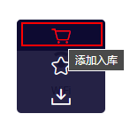
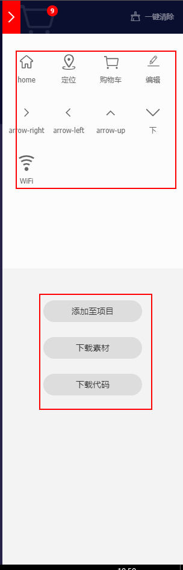
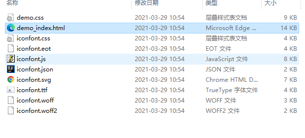
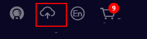
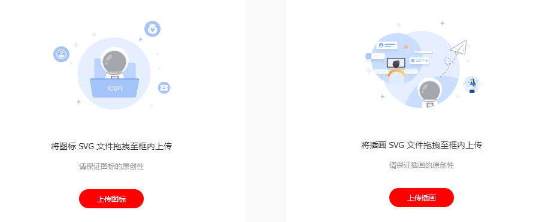
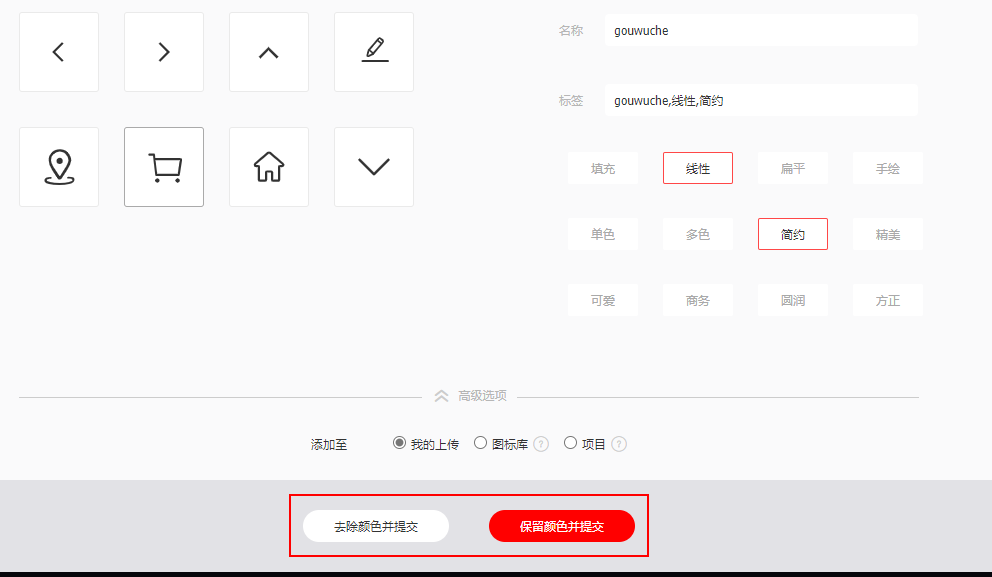
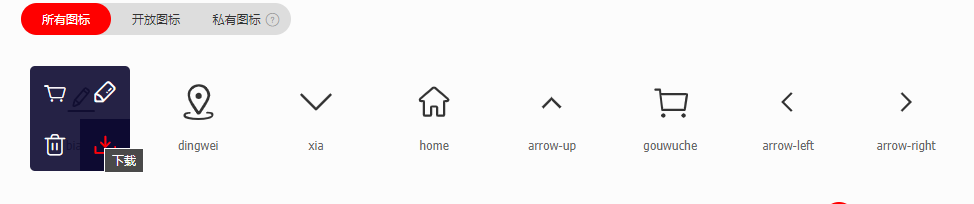

# CSS 字体图标

## 下载使用

打开 [阿里巴巴矢量图标库](https://www.iconfont.cn/)，找到自己需要的图标，并将它加入购物车

下载素材，只会下载矢量图，下载后后面可以将素材生成代码，也可以直接下载代码，这里我们下载代码，然后打开压缩包：

文件下有一个demo文件，我们打开demo_index.html，里面有三种使用方式

## 制作

选中下载好的矢量图（.svg）

然后提交就好了，最后重复上面的步骤就好了。

