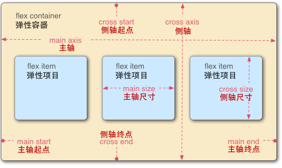
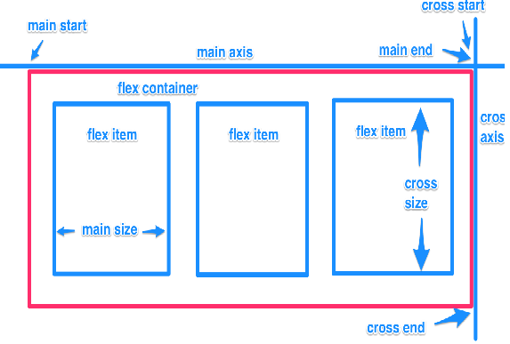

# CSS 布局扩展

## Flex布局

​		CSS3 弹性盒子(Flexible Box 或 Flexbox)，是一种用于在页面上布置元素的布局模式，使得当页面布局必须适应不同的屏幕尺寸和不同的显示设备时，元素可预测地运行/列。对于许多应用程序，弹性盒子模型提供了对块模型的改进，因为它不使用浮动，flex容器的边缘也不会与其内容的边缘折叠。

弹性盒模型，分老版与新版:

    + 老版本的我们通常称之为box
    + 新版本的我们通常称之为flex

主轴 与 侧轴由 `-webkit-box-orient` 属性确定

有了新版本后，为什么还需要老版本？（新版本比老版本要强大的很多）很多移动端浏览器内核版本都超低。

> 项目永远在主轴的正方向上排列      

### 老版

容器设置display为webkit-box

```css
display:webkit-box
```

#### 容器的布局方向

```css
-webkit-box-orient: horizontal;
-webkit-box-orient: vertical;
```

> 注意:项目永远是在主轴上排列的
> -webkit-box-orient属性本质上确定了主轴是哪一根
> horizontal:x轴
> vertical:y轴

#### 容器的排列方向

```css
-webkit-box-direction: normal;
-webkit-box-direction: reverse;    
```

> 注意:项目永远是沿着主轴的正方向排列的
>  -webkit-box-direction属性本质上改变了主轴的方向

#### 富裕空间的管理

 富裕空间的管理（主轴）

```css
-webkit-box-pack: start;/*主轴是X，富裕空间在右边；主轴是Y，富裕空间在下*/
-webkit-box-pack: end;/*主轴是X，富裕空间在左边；主轴是Y，富裕空间在上*/
-webkit-box-pack: center;/*主轴是X，富裕空间在X两边；主轴是Y，富裕空间在Y两边*/
-webkit-box-pack: justify;/*主轴是X，富裕空间在项目中间；主轴是Y，富裕空间在项目中间*/
```

> 上面都是不考虑`-webkit-box-direction:reverse`的情况。

富裕空间的管理（侧轴）

```css
/*定义主轴为Y轴，侧轴为X轴*/
-webkit-box-orient:vertical;
-webkit-box-align:start;/*富裕空间在右边（X轴|主轴）*/
-webkit-box-align:end;/*富裕空间在左边*/
-webkit-box-align:center;/*富裕空间在侧轴的两边*/
```

> -webkit-box-align:center; 不会给项目区分配空间，只是确定富裕空间的位置
>
> 如果使用了`-webkit-box-direction` 属性，富裕空间会出现变化。

#### 弹性空间管理

```css
-webkit-box-flex: 1;
```

​		将主轴上的富裕空间按比例分配到项目上!

例：

```css
#wrap > .item{
    width: 50px;
    height: 50px;
    background: pink;
    text-align: center;
    line-height: 50px;
    -webkit-box-flex: 1;
}
#wrap > .item:nth-child(5){
    -webkit-box-flex: 4;
}
```


### 新版

容器设置display为flex

```css
display:flex;
```


#### 容器的布局方向

```css
flex-direction: row;/*X轴为主轴*/
flex-direction: column;/*Y轴为主轴*/
```

#### 容器排列方向

```css
flex-direction:row-reverse;/*X轴为主轴,从最右侧开始排列*/
flex-direction:column-reverse; /*Y轴为主轴,从最下侧开始排列*/
```

#### 富裕空间的管理

更强大的富裕空间的管理（主轴）

```css
justify-content: flex-start;/*富裕空间在主轴的正方向*/
justify-content: flex-end;/*富裕空间在主轴的反方向*/
justify-content: center;/*富裕空间在主轴的两边*/
justify-content: space-between;/*富裕空间在项目之间*/
justify-content: space-around;/*富裕空间在项目两边*/
```

更强大的富裕空间的管理（侧轴）

```css
align-items: stretch;/*等高布局;*/
align-items: flex-start;/*富裕空间在侧轴的正方向;*/
align-items: flex-end;/*富裕空间在侧轴的反方向;*/
align-items: center;/*富裕空间在侧轴的正方向;*/
align-items: baseline;/*按基线对齐;*/
```

#### 弹性空间的管理

```css
flex-grow: 1
```

## 新版Flex布局详解

[阮一峰](http://www.ruanyifeng.com/blog/2015/07/flex-grammar.html?utm_source=tuicool)

弹性容器属性：

+ flex-direction：定义主轴，及主轴的方向

+ flex-wrap：是否换行

  > 控制了容器为单行/列还是多行/列。并且定义了侧轴的方向，新行/列将沿侧轴方向堆砌。
  > 默认值：nowrap     不可继承
  > 值：nowrap | wrap | wrap-reverse 

+  flex-flow

  > flex-flow 属性是设置“flex-direction”和“flex-wrap”的简写
  > 默认值：row nowrap    不可继承
  > 控制主轴和侧轴的位置以及方向

+  justify-content：定义主轴的富裕空间位置

+  align-items：定义侧轴的富裕空间位置

+ align-content

  > 定义弹性容器的侧轴方向上有额外空间时，如何排布每一行/列。当弹性容器只有一行/列时无作用。
  > 默认值：stretch    不可继承 
  > 值：
  >
  > + flex-start
  >       所有行/列从侧轴起点开始填充。第一行/列的侧轴起点边和容器的侧轴起点边对齐。
  >       接下来的每一行/列紧跟前一行/列。
  > + flex-end
  >       所有弹性元素从侧轴末尾开始填充。最后一个弹性元素的侧轴终点和容器的侧轴终点对齐。
  >       同时所有后续元素与前一个对齐。
  > + center
  >       所有行/列朝向容器的中心填充。每行/列互相紧挨，相对于容器居中对齐。
  >       容器的侧轴起点边和第一行/列的距离相等于容器的侧轴终点边和最后一行/列的距离。
  > + space-between
  >       所有行/列在容器中平均分布。相邻两行/列间距相等。

弹性元素属性

+ order

  > 规定了弹性容器中的可伸缩项目在布局时的顺序。元素按照 order 属性的值的增序进行布局。拥有相同 order 属性值的元素按照它们在源代码中出现的顺序进行布局。
  > order越大越后，默认值：0   不可继承

+ align-self

  > align-self 会对齐当前 flex 行中的 flex 元素，并覆盖 align-items 的值. 如果任何 flex 元素的侧轴方向 margin 值设置为 auto，则会忽略 align-self。
  > 默认值：auto    不可继承
  >
  > 值：
  >
  > + auto: 设置为父元素的 align-items 值，如果该元素没有父元素的话，就设置为 stretch。
  > + flex-start:  flex 元素会对齐到 cross-axis 的首端。
  > + flex-end: flex 元素会对齐到 cross-axis 的尾端。
  > + center: flex 元素会对齐到 cross-axis 的中间，如果该元素的 cross-size 的尺寸大于 flex 容器，将在两个方向均等溢出。
  >
  > + baseline: 所有的 flex 元素会沿着基线对齐，
  > + stretch: flex 元素将会基于容器的宽和高，按照自身 margin box 的 cross-size 拉伸

+ flex-grow

  > flex-grow 属性定义弹性盒子项（flex item）的拉伸因子。 
  > 可用空间 = (容器大小 - 所有相邻项目flex-basis的总和)
  > 可扩展空间 = (可用空间/所有相邻项目flex-grow的总和)
  > 每项伸缩大小 = (伸缩基准值 + (可扩展空间 x flex-grow值))

+ flex-shrink

  > flex-shrink 属性指定了 flex 元素的收缩因子  默认值为1

+ flex-basis

  > flex-basis 指定了 flex 元素在主轴方向上的初始大小
  > 默认值 ：auto  不可继承。    在flex简写属性中 flex-basis的默认值为0

+ flex:是 flex-grow，flex-shrink，flex-basis 的简写属性

  > 默认值 
  > flex-grow: 0 
  > flex-shrink: 1
  > flex-basis: auto 
  >
  > 值
  >
  > ```css
  > /* 0 0 auto */ 
  > flex: none;
  > flex：1;/* 1 1 0% */
  > ```
  >
  > 






## 响应式布局核心（媒体查询）

### 媒体类型

1. all              所有媒体
2. print           打印预览
3. screen        彩色屏幕

### 媒体特性

1. min-width：分辨率宽度大于设置值的时候识别
2. max-width：分辨率宽度小于设置值的时候识别
3. orientation：portrait   ：竖屏
4. orientation：landscape：横屏
5. min-device-pixel-ratio：像素比

### 关键字

1. and  连接媒体特性
2. not  排除指定媒体类型
3. only 指定某种特定的媒体类型
4. `,`连接多条查询规则

## 多列布局（分栏布局）

+ column-width：栏目宽度，指定每一栏的宽度（这是多列布局的第一种分法）
+ column-count：栏目列数，指定要多少栏（这是多列布局的第二种分法）
+ column-gap：栏目距离
+ column-rule：栏目间隔线