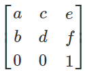
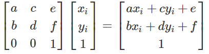
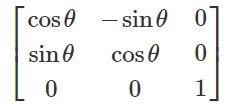
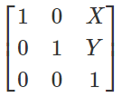
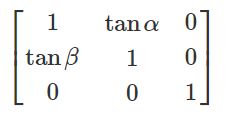
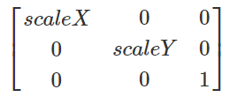

# CSS 过渡 & 变形

## 过渡

> 过渡只关心元素的初始状态和结束状态，没有方法可以获取元素在过渡中每一帧的状态
>
> 元素在初次渲染还没有结束的时候，是没有办法触发过渡的
>
> 在绝大部分变换样式的切换时，变换组合的个数或位置不一样时，是没有办法触发过渡的

### transition  

   	 众所周知，css效率极高，其变化的过程往往都是在一瞬间完成，速度极快。
   		CSS transition 提供了一种在更改CSS属性时控制动画速度的方法。 其可以让属性变化成为一个持续一段时间的过程，而不是立即生效的。比如，将一个元素的颜色从白色改为黑色，通常这个改变是立即生效的，使用 CSS transitions 后该元素的颜色将逐渐从白色变为黑色，按照一定的曲线速率变化。这个过程可以自定义

+ 简写属性transition:
  transition是一个简写属性，用于 

  + transition-property
  + transition-duration
  + transition-timing-function
  + transition-delay。 

  > CSS 过渡 由简写属性 transition 定义是最好的方式，可以避免属性值列表长度不一，节省调试时间 

+ 默认值：
      transition-delay: 0s
      transition-duration: 0s
      transition-property: all
      transition-timing-function: ease

> 注意:
> 在transition属性中，各个值的书写顺序是很重要的：第一个可以解析为时间的值会被赋值给transition-duration，第二个可以解析为时间的值会被赋值给transition-delay
>
> 推荐抒写顺序:
>  过渡时间  过渡样式  过渡形式  延迟时间 [，过渡时间  过渡样式  过渡形式  延迟时间]
>
> 兼容性
>  transition 可以不用厂商前缀，不过鉴于标准刚刚稳定，对于基于 Webkit的浏览器仍然需要厂商前缀。如果想兼容旧版本的浏览器那么也需要厂商前缀（例如Firefox 15 及之前版本, Opera 12 及之前版本)
>
> 当属性值的列表长度不一致时:
> 跟时间有关的重复列表
> transition-timing-function使用默认值

#### transition-property

指定应用过渡属性的名称，默认值为 all，表示所有可被动画的属性都表现出过渡动画(https://developer.mozilla.org/zh-CN/docs/Web/CSS/CSS_animated_properties)

可以指定多个 property 

属性值：  

+ none 没有过渡动画。
+ all 所有可被动画的属性都表现出过渡动画。
+ IDENT 属性名称 （可以指定多个）

> 指定过渡动画的属性（并不是所有的属性都可以动画）

#### transition-duration

​		属性以秒或毫秒为单位指定过渡动画所需的时间。
默认值为 0s ，表示不出现过渡动画。

可以指定多个时长，每个时长会被应用到由 transition-property 指定的对应属性上。如果指定的时长个数小于属性个数，那么**时长列表会重复**。如果时长列表更长，那么该列表会被裁减。两种情况下，属性列表都保持不变。

属性值

+ 以毫秒或秒为单位的数值

  > `<time>` 类型。表示过渡属性从旧的值转变到新的值所需要的时间。如果时长是 0s ，表示不会呈现过渡动画，属性会瞬间完成转变。不接受负值。一定要加单位(不能写0 一定要写0s  1s,0s,1s)！

> 指定过渡动画的时间（0也要带单位）

#### transition-timing-function

​		CSS属性受到 transition的影响，会产生不断变化的中间值，而 CSS transition-timing-function 属性用来描述这个中间值是怎样计算的。实质上，通过这个函数会建立一条加速度曲线，因此在整个transition变化过程中，变化速度可以不断改变
默认值：ease

你可以规定多个timing function,通过使用 transition-property属性，可以根据主列表(transition property的列表)给每个CSS属性应用相应的timing function.如果timing function的个数比主列表中数量少，缺少的值被设置为初始值（ease） 。如果timing function比主列表要多，timing function函数列表会被截断至合适的大小。这两种情况下声明的CSS属性都是有效的。

属性值：
         1、ease：（加速然后减速）默认值，ease函数等同于贝塞尔曲线(0.25, 0.1, 0.25, 1.0).
         2、linear：（匀速），linear 函数等同于贝塞尔曲线(0.0, 0.0, 1.0, 1.0).
         3、ease-in：(加速)，ease-in 函数等同于贝塞尔曲线(0.42, 0, 1.0, 1.0).
         4、ease-out：（减速），ease-out 函数等同于贝塞尔曲线(0, 0, 0.58, 1.0).
         5、ease-in-out：（加速然后减速），ease-in-out 函数等同于贝塞尔曲线(0.42, 0, 0.58, 1.0)
         6、cubic-bezier： 贝塞尔曲线
         7、step-start：等同于steps(1,start)
         8、step-end：等同于steps(1,end)
         9、steps(`<integer>`,[,[start|end]]?)
                      第一个参数：必须为正整数，指定函数的步数
                      第二个参数：指定每一步的值发生变化的时间点（默认值end）

> 指定过渡动画的形式（贝塞尔）

#### transition-delay

> 指定过渡动画的延迟

​		transition-delay属性规定了在过渡效果开始作用之前需要等待的时间。
默认值：0s 

​		你可以指定多个延迟时间，每个延迟将会分别作用于你所指定的相符合的css属性。如果指定的时长个数小于属性个数，那么时长列表会重复。如果时长列表更长，那么该列表会被裁减。两种情况下，属性列表都保持不变

属性值
       值以秒（s）或毫秒（ms）为单位，表明动画过渡效果将在何时开始。取值为正时会延迟一段时间来响应过渡效果；取值为负时会导致过渡立即开始。

#### 属性值的列表长度不一致时

```css
transition-property: background,width,height;
transition-duration: 3s,2s;
transition-delay:3s,2s;
transition-timing-function:linear;
```

```css
transition-property: background,width,height;
transition-duration: 3s,2s,3s;
transition-delay:3s,2s,3s;
transition-timing-function:linear,ease,ease;
```

> 超出的情况下是会被全部截掉的
>
> 不够的时候，关于时间的会重复列表，
>
> transition-timing-function的时候使用的是默认值ease

 

#### 检测过渡是否完成

​		当过渡完成时触发一个事件，在符合标准的浏览器下，这个事件是 transitionend, 在 WebKit 下是 webkitTransitionEnd
（每一个拥有过渡的属性在其完成过渡时都会触发一次transitionend事件）

> 在transition完成前设置 display: none，事件同样不会被触发

 ```javascript
dom.addEventListener("transitionend",function(){
    alert("end");
})
 ```

> transtionend事件（DOM2）在每个属性完成过渡时都会触发这个事件

## 变形

> 顺序是从右往左的，变换的底层其实就是矩阵的运算。
> 变换组合时,计算方向是从右往左进行继续的。
>
> 在元素首次渲染还没有完成的情况下,是不会触发过渡的。
> 在绝大部分变换样式切换时,如果变换函数的位置 个数不相同也不会触发过渡。

### 2D变形transform

​		CSS**`transform`**属性允许你旋转，缩放，倾斜或平移给定元素。这是通过修改CSS视觉格式化模型的坐标空间来实现的

> transform 属性 , 只对 block 级元素生效！

#### 旋转（rotate）

```css
transform:rotate(angle); 
```

angle 为正值时:顺时针旋转  rotate(360deg)
angle 为负值:逆时针旋转  rotate(-360deg)

> 只能设单值。正数表示顺时针旋转，负数表示逆时针旋转

#### 平移（translate）

+ X方向平移:transform:  translateX(tx)
+ Y方向平移:transform:  translateY(ty) 
+ 二维平移：transform:  translate(tx[, ty])； 如果ty没有指定，它的值默认为0。

> 可设单值，也可设双值。
> 正数表示XY轴正向位移，负数为反向位移。设单值表示只X轴位移，Y轴坐标不变。
> 例如:
>
> ```css
> transform: translate(100px);
> ```
>
> 等价于
>
> ```css
> transform: translate(100px,0);
> ```

#### 倾斜（skew）

```css
transform:skewX(45deg);
```

+ X方向倾斜:transform:  skewX(angle)

  > skewX(45deg):参数值以deg为单位 代表与y轴之间的角度

+ Y方向倾斜:transform:  skewY(angle)

  >skewY(45deg):参数值以deg为单位 代表与x轴之间的角度

+ 二维倾斜:transform:  skew(ax[, ay]);  如果ay未提供，在Y轴上没有倾斜

  > skew(45deg,15deg):参数值以deg为单位 第一个参数代表与y轴之间的角度,第二个参数代表与x轴之间的角度。单值时表示只X轴扭曲，Y轴不变，如
  >
  >```css
  >transform: skew(30deg);
  >等价于                     
  >transform: skew(30deg, 0);
  >```
  >
  >考虑到可读性，不推荐用单值，应该用
  >
  >```css
  >transform: skewX(30deg);
  >```
  >
  >skewY表示  只Y轴扭曲，X轴不变。 

> 正值:拉正斜杠方向的两个角
> 负值:拉反斜杠方向的两个角                   

#### 缩放（scale）

```css
transform:scale(2);
```

+ X方向缩放:transform:  scaleX(sx); 

+ Y方向缩放:transform:  scaleY(sy);

+ 二维缩放 :transform:  scale(sx[, sy]);  (如果sy 未指定，默认认为和sx的值相同)  

  > 要缩小请设0.01～0.99之间的值，要放大请设超过1的值。
  >
  > 例如缩小一倍可以
  >
  > ```css
  > transform: scale(.5);
  > ```
  >
  > 放大一倍可以：
  >
  > ```css
  > transform: scale(2);
  > ```
  >
  > 如果只想X轴缩放，可以用scaleX(.5)相当于scale(.5, 1)。 同理,只想Y轴缩放，可以用scaleY(.5)相当于scale(1, .5)

> 注意：
>
> 正值:缩放的程度
> 负值:不推荐使用（有旋转效果）
> 单值时表示只X轴,Y轴上缩放粒度一样，如transform: scale(2);等价于transform: scale(2,2);

#### 基点的变换

放在需要改变基点的元素身上：

```css
transform-origin: 100px 100px;
```

> 从元素的左上角值是 0，0；往右x增加，往下y增加

 transform-origin CSS属性让你更改一个元素变形的基点。

> 基点也可以写关键字：
>
> ```css
> transform-origin: center;
> transform-origin: top left;
> transform-origin: 50px 50px;
> transform-origin: bottom right 60px;
> ```
>
> `transform-origin`属性可以使用一个，两个或三个值来指定，其中每个值都表示一个偏移量。 没有明确定义的偏移将重置为其对应的[初始值](https://developer.mozilla.org/zh-CN/docs/Web/CSS/initial_value)。
>
> 如果定义了两个或更多值并且没有值的关键字，或者唯一使用的关键字是`center`，则第一个值表示水平偏移量，第二个值表示垂直偏移量。

- 一个值：
  - 必须是`length`,`percentage`,或 `left`, `center`, `right`, `top`, `bottom`关键字中的一个。
- 两个值：
  - 其中一个必须是`length`,`percentage`,或 `left`, `center`, `right`, `top`, `bottom`关键字中的一个。
  - 另一个必须是`length`,`percentage`或`top`, `center`, `bottom`关键字中的一个。
- 三个值：
  - 前两个值和只有两个值时的用法相同。
  - 第三个值必须是`length`。它始终代表Z轴偏移量。

#### 矩阵（matrix）

在 2D变换 中，矩阵变换函数 matrix() 接受 6个值，语法形式如下：
       transform: matrix(a, b, c, d, e, f);  

这相当于，对元素应用一个如下的变换矩阵：



点(Xi,Yi,1)进行变换后的新坐标



即根据变换矩阵进行变换之后点 (xi,yi) 的坐标是(axi+cyi+e,bxi+dyi+f)

##### 旋转

对某一元素应用旋转变换 rotate(θ)，相当于对其应用如下变换矩阵：



即等价于矩阵变换函数 matrix(cosθ, sinθ, -sinθ, cosθ, 0, 0)。

##### 平移

对某一元素应用旋转变换 translate(X, Y)，相当于对其应用如下变换矩阵：



即等价于使用矩阵变换函数 matrix(1, 0, 0, 1, X, Y)。

##### 倾斜

对某一元素应用倾斜变换 skew(α, β)，相当于对其应用如下变换矩阵：



即等价于使用矩阵变换函数 matrix(1, tanβ, tanα,1, 0, 0)。

##### 缩放

对某一元素应用缩放变换 scale(scaleX, scaleY)，相当于对其应用如下变换矩阵：



即等价于使用矩阵变换函数 matrix(scaleX, 0, 0, scaleY, 0, 0)

### 3D变形

在浏览器中，X轴是从左到右，Y轴是从上到下，Z轴是从里到外。

> 需要设置景深，这样对于Z轴的动画才能有效果


#### 3D缩放(scale3d)

```css
transform: scaleZ(number)
transform: scale3d(scaleX,scaleY,scaleZ);
```

​		如果只设置scaleZ(number)，你会发现元素并没有被扩大或压缩，scaleZ(number)需要和translateZ(length)配合使用，number乘以length得到的值，是元素沿Z轴移动的距离，从而使得感觉被扩大或压缩 

#### 3D旋转（rotate3d）

​		CSS3中的3D旋转主要包括四个功能函数:

1. rotateX(angle)、

2.  rotateY(angle)、

3.  rotateZ(angle)、等价于rotate(angle)

4. rotate3d(x,y,z,angle)

   > x, y, z分别接受一个数值(number),用来计算矢量方向(direction vector)，矢量方向是三维空间中的一条线, 从坐标系原点到x, y, z值确定的那个点，元素围绕这条线旋转angle指定的值

> 注意：
>
> `rotate3d(x,y,z,angle)`,x > 0 表示元素是延x轴往里旋转（顺时针）；y>0表示元素延y轴右旋转（逆时针）；z>0时，元素延z轴顺时针旋转。某个轴的值越大，元素旋转延该轴就越明显。

#### 3D平移

​		`transform: translateZ(length)`是3D Transformaton特有的，其他两个2D中就有。

```css
transform:translate3d(translateX,translateY,translateZ);
```

> translateZ  它不能是百分比 值; 那样的移动是没有意义的。
>
> 

#### 景深 perspective

> 景深（英语：Depth of field, DOF）景深是指相机对焦点前后相对清晰的成像范围。在光学中，尤其是录影或是摄影，是一个描述在空间中，可以清楚成像的距离范围。虽然透镜只能够将光聚 到某一固定的距离，远离此点则会逐渐模糊，但是在某一段特定的距离内，影像模糊的程度是肉眼无法察觉的，这段距离称之为景深。当焦点设在超焦距处时，景深 会从超焦距的一半延伸到无限远，对一个固定的光圈值来说，这是最大的景深

  	简单的理解，景深就是我们的肉眼距离显示器的距离，景深越大，元素离我们越远，效果就不好，在我们CSS3中，perspective用于激活一个3D空间，属性值就是景深大小（默认none无景深）
  		应用景深的元素称为“舞台元素”，舞台元素的所有后代元素都会受影响，（如果后代元素中也添加了perspective属性，效果会叠加而不是覆盖）

```css
transform: perspective(depth);
```

​		depth的默认值是none，可以设置为一个长度值，这个长度是沿着Z轴距离坐标原点的距离。1000px被认为是个正常值， 若使用perspective()函数，那么他必须被放置在transform属性的首位，如果放在其他函数之后，则会被忽略

```css
perspective: depth;
```

​    同perspective()函数一样，depth的默认值是none，可以设置为一个长度值，这个长度是沿着Z轴距离坐标原点的距离。他们唯一的区别是，perspective属性是被用于元素的后代元素，而不是元素本身；就是说，为某个元素设置perspective属性后，是对这个元素的子元素起作用，而不是这个元素本身。

```css
perspective-origin
```

​    同perspective属性，也是设置在父元素上，对后代元素起作用。 这个属性来设置你在X, Y轴坐标确定的那个点来看这个元素，Z轴是被perspective属性设置的 

#### backface-visibility

​		backface-visibility属性用来设置，是否显示元素的背面，默认是显示的。

```css
backface-visibility: keyword;
```

keyword有两个值，hidden和visible，默认值是visible。

> 藏元素背面, 一个元素分两面，但并不意味元素有厚度。在一个状态下，元素只能展现自己的一面

#### transform-style

​		这个属性指定了子元素如何在空间中展示，只有两个属性值：

1. flat（默认）
2. preserve-3d

> flat 表示所有子元素在2D平面呈现，
> preserve-3d 表示所有子元素在3D平面呈现，

​		如果被扁平化，则子元素不会独立的存在于三维空间。因为该属性不会被（自动）继承，所以必须为元素所有非叶后代节点设置该属性。

> 营造有层级的3d舞台,是一个不可继承属性，他作用于子元素